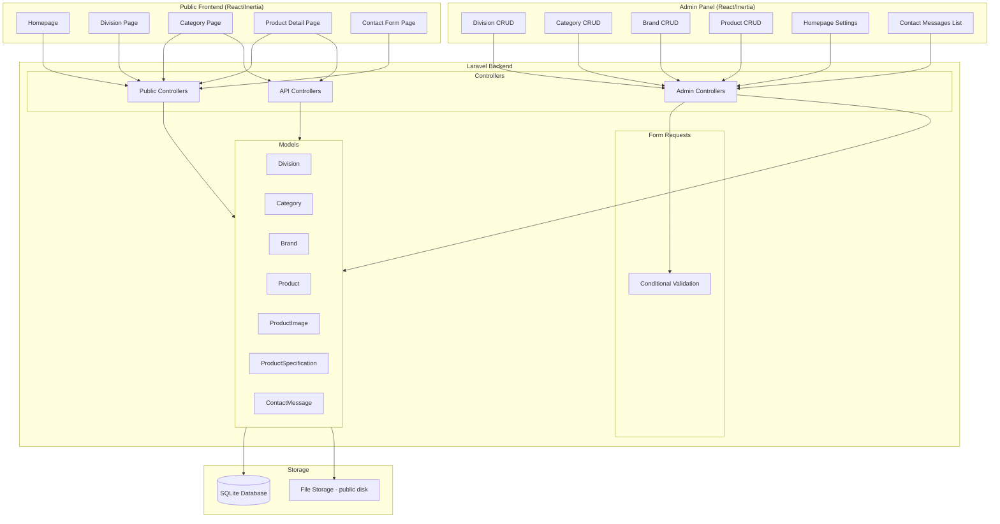
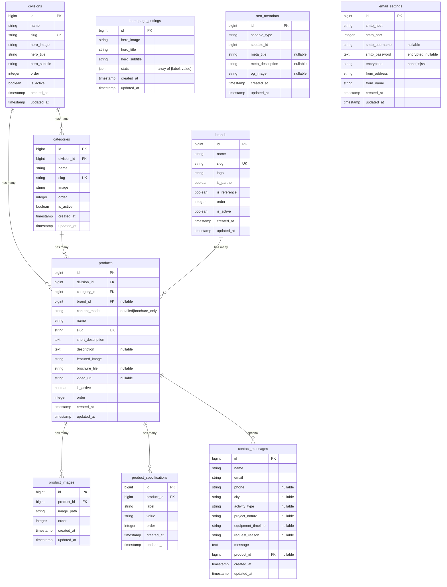

# Design Document: Product Showcase

## Overview

This design describes a corporate product showcase system for Bella Forme Group, built on the existing Laravel 12 + React 19 (Inertia.js) application. The system introduces six new Eloquent models (Division, Category, Brand, Product, ProductImage, ProductSpecification, ContactMessage), a set of admin controllers using Inertia for CRUD, public-facing Inertia pages for the visitor experience, and a small JSON API layer for product listing/detail. The central architectural decision is a single `products` table with a `content_mode` discriminator ("detailed" vs "brochure_only") that drives conditional validation, form rendering, and frontend routing.

The existing application already provides authentication (Fortify), user settings, Inertia middleware, shadcn/ui components, and Tailwind CSS 4. This design extends that foundation without modifying existing functionality.

## Architecture



### Routing Strategy

The application uses two routing approaches:

1. **Inertia Routes** (web.php): For all page rendering — both public pages and admin panel. These return Inertia responses that render React components.
2. **API Routes** (api.php): For JSON endpoints used by the frontend for dynamic data loading (product listing with filters, product detail).

Admin routes are grouped under `/admin` prefix with `auth` and `verified` middleware. Public routes use no authentication.

### File Upload Strategy

All file uploads (images, brochures, logos) use Laravel's `public` disk (`storage/app/public`). The `storage:link` command creates a symlink so files are accessible at `/storage/...` URLs. File paths stored in the database are relative to the public disk root.

## Components and Interfaces

### Backend Components

#### Eloquent Models

| Model | Table | Key Relationships |
|-------|-------|-------------------|
| Division | divisions | hasMany(Category), hasManyThrough(Product) |
| Category | categories | belongsTo(Division), hasMany(Product) |
| Brand | brands | hasMany(Product) |
| Product | products | belongsTo(Division, Category, Brand), hasMany(ProductImage), hasMany(ProductSpecification) |
| ProductImage | product_images | belongsTo(Product) |
| ProductSpecification | product_specifications | belongsTo(Product) |
| ContactMessage | contact_messages | belongsTo(Product, nullable) |

Each model uses the `HasFactory` trait for testing. The Product model includes a scope `scopeActive()` for filtering `is_active = true` and a scope `scopeDetailed()` for filtering `content_mode = 'detailed'`.

#### SEO Metadata (Polymorphic)

SEO metadata is stored in a `seo_metadata` table using a polymorphic relationship (`seoable_type`, `seoable_id`). This allows Division, Category, Product, and a `PageSeo` model (for static pages like homepage, contact, about) to each have associated SEO fields. The `SeoMetadata` model has fields: `meta_title`, `meta_description`, `og_image`, and the polymorphic keys.

A `HasSeo` trait (in `app/Concerns/HasSeo.php`) is added to Division, Category, and Product models, providing a `seo()` morphOne relationship and a `getSeoData()` method that returns SEO fields with fallback defaults (name → meta_title, short_description/hero_subtitle → meta_description, featured_image/hero_image → og_image).

#### Email Settings and Dynamic SMTP

The `EmailSettings` model stores SMTP configuration in the database. The `smtp_password` field uses Laravel's `encrypted` cast for secure storage. A `DynamicSmtpService` (in `app/Services/DynamicSmtpService.php`) reads the stored settings and configures Laravel's mailer at runtime using `Config::set()` before sending. This allows admins to change SMTP settings without redeploying.

A `ContactFormNotification` Mailable is sent when a contact form is submitted. If SMTP settings are missing or sending fails, the error is logged but the contact message is still saved to the database.

#### Image Optimization

An `ImageOptimizer` service (in `app/Services/ImageOptimizer.php`) handles image processing using the Intervention Image library (`intervention/image`). When an image is uploaded through any admin form, the service:

1. Stores the original image on the public disk
2. Generates WebP versions at three sizes: thumbnail (150px width), medium (600px width), and large (1200px width)
3. Stores optimized versions alongside the original with a naming convention: `{filename}-thumb.webp`, `{filename}-medium.webp`, `{filename}-large.webp`

A `HasOptimizedImages` trait provides helper methods to models for retrieving optimized image URLs. When an image is deleted, the trait's `deleteOptimizedImages()` method removes all associated versions.

On the frontend, an `OptimizedImage` React component renders a `<picture>` element with `<source>` tags for WebP and `srcset` for responsive sizes, with `loading="lazy"` for below-the-fold images.

#### Slug Auto-Generation

Division, Category, Brand, and Product models use a shared `HasSlug` trait (placed in `app/Concerns/HasSlug.php`) that auto-generates a slug from the `name` field using Laravel's `Str::slug()` during the `creating` event, only when the slug is empty.

#### Controllers

**Admin Controllers** (under `App\Http\Controllers\Admin`):

| Controller | Routes | Purpose |
|------------|--------|---------|
| DivisionController | admin/divisions (resource) | CRUD for divisions |
| CategoryController | admin/categories (resource) | CRUD for categories |
| BrandController | admin/brands (resource) | CRUD for brands |
| ProductController | admin/products (resource) | CRUD for products with conditional logic |
| ContactMessageController | admin/contact-messages (index, show) | Read-only message viewing |
| HomepageController | admin/homepage (edit, update) | Homepage content management |
| SeoController | admin/seo (edit, update) | Static page SEO management |
| EmailSettingsController | admin/email-settings (edit, update, test) | SMTP configuration management |

**Public Controllers** (under `App\Http\Controllers\Public`):

| Controller | Routes | Purpose |
|------------|--------|---------|
| HomeController | / | Homepage rendering |
| DivisionController | /division/{slug} | Division page with categories |
| CategoryController | /division/{division}/category/{slug} | Category page with products |
| ProductController | /product/{slug} | Single product page (detailed only) |
| ContactController | /contact | Contact form page and submission |

**API Controllers** (under `App\Http\Controllers\Api`):

| Controller | Routes | Purpose |
|------------|--------|---------|
| ProductController | GET /api/products?category=&brand= | Product listing with filters |
| ProductController | GET /api/product/{slug} | Product detail (detailed only, 404 for brochure_only) |

#### Form Requests

**StoreProductRequest / UpdateProductRequest**: Implements conditional validation using Laravel's `sometimes` and `required_if` rules:

```php
public function rules(): array
{
    return [
        'content_mode' => ['required', 'in:detailed,brochure_only'],
        'division_id' => ['required', 'exists:divisions,id'],
        'category_id' => ['required', 'exists:categories,id'],
        'brand_id' => ['nullable', 'exists:brands,id'],
        'name' => ['required', 'string', 'max:255'],
        'slug' => ['nullable', 'string', 'max:255', 'unique:products,slug'],
        'short_description' => ['required', 'string'],
        'featured_image' => ['required', 'image'],
        'description' => ['required_if:content_mode,detailed', 'nullable', 'string'],
        'brochure_file' => ['required_if:content_mode,brochure_only', 'nullable', 'file', 'mimes:pdf'],
        'video_url' => ['nullable', 'url'],
        'is_active' => ['boolean'],
        'order' => ['integer'],
        'specifications' => ['nullable', 'array'],
        'specifications.*.label' => ['required_with:specifications', 'string'],
        'specifications.*.value' => ['required_with:specifications', 'string'],
        'gallery' => ['nullable', 'array'],
        'gallery.*' => ['image'],
    ];
}
```

The `prepareForValidation` method strips specifications and gallery data when `content_mode` is "brochure_only".

### Frontend Components

#### Page Components (Inertia Pages)

| Page | Path | Description |
|------|------|-------------|
| pages/home.tsx | / | Homepage with hero, division showcases, stats |
| pages/division/show.tsx | /division/:slug | Division page with category grid |
| pages/category/show.tsx | /division/:div/category/:slug | Category page with product grid and brand filter |
| pages/product/show.tsx | /product/:slug | Single product detail page |
| pages/contact.tsx | /contact | Contact form page |
| pages/admin/divisions/* | /admin/divisions/* | Division CRUD pages |
| pages/admin/categories/* | /admin/categories/* | Category CRUD pages |
| pages/admin/brands/* | /admin/brands/* | Brand CRUD pages |
| pages/admin/products/* | /admin/products/* | Product CRUD pages |
| pages/admin/contact-messages/* | /admin/contact-messages/* | Contact message list/detail |
| pages/admin/homepage/edit.tsx | /admin/homepage/edit | Homepage content editor |
| pages/admin/email-settings/edit.tsx | /admin/email-settings/edit | SMTP settings editor with test button |
| pages/admin/seo/edit.tsx | /admin/seo/edit | Static page SEO editor |

#### Shared UI Components

| Component | Purpose |
|-----------|---------|
| ProductCard | Renders a product card with conditional button based on content_mode |
| CategoryCard | Renders a category card with "Explorer" button |
| DivisionShowcase | Renders a division section on the homepage |
| BrandCarousel | Renders a horizontal carousel of brand logos |
| HeroSection | Renders a hero banner with background image and text overlay |
| StatsSection | Renders the stats counters section |
| ContactForm | Reusable contact form with all fields |
| ProductTypeSelector | Toggle between "Full Product" and "Catalog Only" in admin |
| SpecificationsEditor | Dynamic list editor for product specifications |
| GalleryUploader | Multi-image upload with reordering for product gallery |
| BrandFilter | "Filtrer par marque" dropdown component |
| SeoHead | Renders `<Head>` with meta_title, meta_description, og:title, og:description, og:image, and canonical URL using Inertia's `<Head>` component |
| JsonLdProduct | Renders JSON-LD structured data for product detail pages |
| OptimizedImage | Renders `<picture>` element with WebP sources, srcset for responsive sizes, and lazy loading |

#### ProductCard Conditional Logic

```typescript
function ProductCard({ product }: { product: Product }) {
    if (product.content_mode === 'detailed') {
        return (
            <Card>
                {/* ... card content ... */}
                <Link href={`/product/${product.slug}`}>En savoir plus</Link>
            </Card>
        );
    }

    // brochure_only
    return (
        <Card>
            {/* ... card content ... */}
            <a href={product.brochure_file} target="_blank">Voir la brochure</a>
        </Card>
    );
}
```

## Data Models

### Database Schema



### TypeScript Interfaces

```typescript
interface Division {
    id: number;
    name: string;
    slug: string;
    hero_image: string;
    hero_title: string;
    hero_subtitle: string;
    order: number;
    is_active: boolean;
}

interface Category {
    id: number;
    division_id: number;
    name: string;
    slug: string;
    image: string;
    order: number;
    is_active: boolean;
    division?: Division;
}

interface Brand {
    id: number;
    name: string;
    slug: string;
    logo: string;
    is_partner: boolean;
    is_reference: boolean;
    order: number;
    is_active: boolean;
}

interface Product {
    id: number;
    division_id: number;
    category_id: number;
    brand_id: number | null;
    content_mode: 'detailed' | 'brochure_only';
    name: string;
    slug: string;
    short_description: string;
    description: string | null;
    featured_image: string;
    brochure_file: string | null;
    video_url: string | null;
    is_active: boolean;
    order: number;
    brand?: Brand;
    images?: ProductImage[];
    specifications?: ProductSpecification[];
}

interface ProductImage {
    id: number;
    product_id: number;
    image_path: string;
    order: number;
}

interface ProductSpecification {
    id: number;
    product_id: number;
    label: string;
    value: string;
    order: number;
}

interface ContactMessage {
    id: number;
    name: string;
    email: string;
    phone: string | null;
    city: string | null;
    activity_type: string | null;
    project_nature: string | null;
    equipment_timeline: string | null;
    request_reason: string | null;
    message: string;
    product_id: number | null;
    created_at: string;
    product?: Product;
}

interface HomepageSettings {
    id: number;
    hero_image: string;
    hero_title: string;
    hero_subtitle: string;
    stats: Array<{ label: string; value: string }>;
}

interface SeoMetadata {
    id: number;
    meta_title: string | null;
    meta_description: string | null;
    og_image: string | null;
}

interface SeoData {
    meta_title: string;
    meta_description: string;
    og_image: string | null;
    canonical_url: string;
}

interface EmailSettings {
    id: number;
    smtp_host: string;
    smtp_port: number;
    smtp_username: string | null;
    encryption: 'none' | 'tls' | 'ssl';
    from_address: string;
    from_name: string;
}
```


## Correctness Properties

*A property is a characteristic or behavior that should hold true across all valid executions of a system — essentially, a formal statement about what the system should do. Properties serve as the bridge between human-readable specifications and machine-verifiable correctness guarantees.*

### Property 1: Slug auto-generation from name

*For any* model that uses the HasSlug trait (Division, Category, Brand, Product), if the slug field is empty when saving, the resulting slug should be a URL-safe, lowercased, hyphenated version of the name field, and it should be non-empty.

**Validates: Requirements 1.3, 2.3, 3.3, 4.6**

### Property 2: Active-only filtering with correct ordering

*For any* set of records (divisions, categories, or products) with mixed is_active values and varying order values, querying with the active scope should return only records where is_active is true, and the results should be sorted by the order field in ascending order.

**Validates: Requirements 1.4, 2.4, 6.5**

### Property 3: Content-mode conditional validation

*For any* product submission, if content_mode is "detailed" then description must be present for validation to pass, and if content_mode is "brochure_only" then brochure_file must be present for validation to pass. Conversely, omitting description for a detailed product or omitting brochure_file for a brochure_only product should result in a validation error.

**Validates: Requirements 4.2, 4.3, 5.1, 5.2**

### Property 4: Content_mode enum validation

*For any* string value submitted as content_mode that is not "detailed" or "brochure_only", the Product API should reject the request with a validation error.

**Validates: Requirements 5.4**

### Property 5: Brochure_only strips specifications and gallery

*For any* product submission with content_mode "brochure_only" that includes specifications or gallery image data, the saved product should have zero specifications and zero gallery images in the database.

**Validates: Requirements 5.3**

### Property 6: Brochure_only products return 404 on detail endpoint

*For any* product with content_mode "brochure_only", requesting GET /api/product/{slug} should return a 404 HTTP response.

**Validates: Requirements 7.3, 10.4**

### Property 7: ProductCard conditional rendering

*For any* product, the ProductCard component should render the product name, featured_image, and short_description. Additionally, if content_mode is "detailed", the card should contain a link to /product/{slug} with text "En savoir plus". If content_mode is "brochure_only", the card should contain a link to the brochure_file URL with text "Voir la brochure".

**Validates: Requirements 6.2, 6.3, 6.4**

### Property 8: Product listing with category and brand filters

*For any* category and optional brand filter, the GET /api/products endpoint should return only active products belonging to that category (and matching the brand if specified), and every returned product should include the fields: id, name, slug, content_mode, featured_image, short_description, and brochure_file.

**Validates: Requirements 6.6, 10.1, 10.2**

### Property 9: Division page brand carousels filter correctly

*For any* division, the reference brands shown should all have is_reference=true and have at least one product in that division. Similarly, the partner brands shown should all have is_partner=true and have at least one product in that division. No brand that lacks products in the division should appear in either carousel.

**Validates: Requirements 3.4, 3.5**

### Property 10: API product detail returns complete data for detailed products

*For any* product with content_mode "detailed", requesting GET /api/product/{slug} should return a response containing: description, specifications array, gallery images array, video_url, and brand information.

**Validates: Requirements 10.3**

### Property 11: Product JSON serialization round-trip

*For any* valid Product object, serializing it to JSON via the API and then deserializing the JSON response should produce an object with equivalent field values for all product attributes.

**Validates: Requirements 10.5**

### Property 12: Contact form validation

*For any* contact form submission, if name, email, or message is missing, the Contact API should reject the request with a validation error. Additionally, if the email field contains a string that is not a valid email format, the API should reject the request.

**Validates: Requirements 8.2**

### Property 13: Contact messages ordered by creation date

*For any* set of contact messages with different creation timestamps, the admin list endpoint should return them ordered by created_at descending (newest first).

**Validates: Requirements 8.5**

### Property 14: SEO metadata fallback defaults

*For any* entity (Division, Category, or Product) that has empty SEO metadata fields, the `getSeoData()` method should return non-empty default values: meta_title derived from the entity name, meta_description derived from the entity short_description or hero_subtitle, and og_image derived from the entity featured_image or hero_image.

**Validates: Requirements 12.6**

### Property 15: SEO meta tags rendered on public pages

*For any* public page with associated SEO data, the rendered HTML head should contain a `<title>` tag matching the meta_title, a `<meta name="description">` tag matching the meta_description, and `og:title` and `og:description` meta tags matching the respective SEO fields.

**Validates: Requirements 12.3, 12.4**

### Property 16: Product JSON-LD structured data

*For any* product with content_mode "detailed", the rendered product page should contain a JSON-LD script block of type "Product" with the product name, description, image, and brand name.

**Validates: Requirements 12.8**

### Property 17: Email settings validation

*For any* email settings submission, if smtp_host, smtp_port, from_address, or from_name is missing, the API should reject the request with a validation error. If from_address is not a valid email format, the API should reject the request.

**Validates: Requirements 13.2**

### Property 18: SMTP password encryption

*For any* saved email settings with a non-null smtp_password, the raw value stored in the database should not equal the plaintext password (it should be encrypted).

**Validates: Requirements 13.3**

### Property 19: Contact submission resilience to email failure

*For any* contact form submission, even if the SMTP settings are misconfigured or absent, the contact message should still be persisted to the database successfully.

**Validates: Requirements 13.6**

### Property 20: Image optimization generates all required sizes

*For any* uploaded image, the ImageOptimizer service should produce three additional WebP files (thumbnail, medium, large) alongside the original, and all three files should exist on the public disk.

**Validates: Requirements 14.1**

### Property 21: Image deletion removes all optimized versions

*For any* image that has been optimized, when the original image is deleted, all associated optimized versions (thumbnail, medium, large WebP) should also be removed from storage.

**Validates: Requirements 14.4**

## Error Handling

### Backend Error Handling

| Scenario | Response | HTTP Status |
|----------|----------|-------------|
| Validation failure on any form request | JSON with field-specific error messages | 422 |
| Product detail for brochure_only product | 404 Not Found | 404 |
| Product detail for non-existent slug | 404 Not Found | 404 |
| File upload exceeds size limit | Validation error with size message | 422 |
| Invalid file type (non-image, non-PDF) | Validation error with mime type message | 422 |
| Unauthorized access to admin routes | Redirect to login page | 302 |
| Database constraint violation (duplicate slug) | Validation error with uniqueness message | 422 |
| Missing required foreign key (division_id, category_id) | Validation error with exists message | 422 |

### Frontend Error Handling

| Scenario | Behavior |
|----------|----------|
| Form validation errors | Display inline error messages under each field using Inertia's `usePage().props.errors` |
| 404 on product page | Display a "Page not found" error page |
| File upload failure | Display error toast/message near the upload field |
| Network error on API call | Display a generic error message with retry option |
| Contact form submission success | Display confirmation message and reset form |

### File Upload Constraints

- Images: max 10MB, accepted formats: jpg, jpeg, png, webp
- Brochures: max 60MB, accepted format: pdf
- Logos: max 10MB, accepted formats: jpg, jpeg, png, svg, webp

## Testing Strategy

### Testing Framework

- **Backend**: Pest (already installed) with pest-plugin-laravel for feature tests
- **Frontend**: Vitest for unit/component tests (to be added)
- **Property-Based Testing**: [phpunit/quickcheck](https://github.com/steos/php-quickcheck) or custom generators with Pest for PHP; fast-check for TypeScript/React component tests

### Unit Tests

Unit tests cover specific examples and edge cases:

- Model relationship tests (Division hasMany Categories, etc.)
- Slug generation edge cases (special characters, unicode, very long names)
- Content_mode conditional validation with specific valid/invalid payloads
- ProductCard rendering with specific product fixtures
- Contact form field validation with specific invalid inputs

### Property-Based Tests

Each correctness property maps to a property-based test with minimum 100 iterations:

| Property | Test Location | Generator Strategy |
|----------|--------------|-------------------|
| P1: Slug auto-generation | tests/Feature/SlugGenerationTest.php | Random strings for name field |
| P2: Active filtering + ordering | tests/Feature/ActiveScopeTest.php | Random sets of records with mixed is_active and order |
| P3: Conditional validation | tests/Feature/ProductValidationTest.php | Random product data with content_mode variations |
| P4: Content_mode enum | tests/Feature/ProductValidationTest.php | Random strings for content_mode |
| P5: Brochure strips extras | tests/Feature/ProductValidationTest.php | Brochure_only products with random specs/gallery |
| P6: Brochure 404 | tests/Feature/ProductApiTest.php | Random brochure_only products |
| P7: ProductCard rendering | resources/js/__tests__/ProductCard.test.tsx | Random product objects |
| P8: Product listing filters | tests/Feature/ProductApiTest.php | Random categories, brands, products |
| P9: Division brand carousels | tests/Feature/DivisionBrandsTest.php | Random divisions, brands, products |
| P10: Detail API completeness | tests/Feature/ProductApiTest.php | Random detailed products |
| P11: JSON round-trip | tests/Feature/ProductApiTest.php | Random product objects |
| P12: Contact validation | tests/Feature/ContactTest.php | Random contact submissions |
| P13: Contact ordering | tests/Feature/ContactTest.php | Random contact messages with timestamps |
| P14: SEO fallback defaults | tests/Feature/SeoMetadataTest.php | Random entities with empty SEO fields |
| P15: SEO meta tags rendered | tests/Feature/SeoMetadataTest.php | Random entities with SEO data |
| P16: Product JSON-LD | tests/Feature/ProductSeoTest.php | Random detailed products |
| P17: Email settings validation | tests/Feature/EmailSettingsTest.php | Random email settings data |
| P18: SMTP password encryption | tests/Feature/EmailSettingsTest.php | Random passwords |
| P19: Contact resilience | tests/Feature/ContactTest.php | Random contact data with broken SMTP |
| P20: Image optimization sizes | tests/Feature/ImageOptimizerTest.php | Random test images |
| P21: Image deletion cleanup | tests/Feature/ImageOptimizerTest.php | Random optimized images |

Each test is tagged with: **Feature: product-showcase, Property {N}: {title}**

### Integration Tests

- Full CRUD flow for each admin entity (create → read → update → delete)
- Public page rendering with seeded data
- Product listing API with various filter combinations
- Contact form submission end-to-end flow
